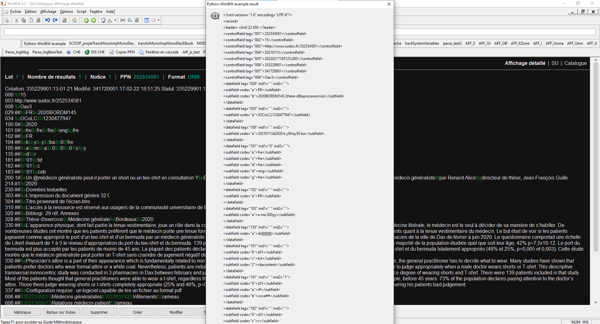

# Python-WinIBW

Python-WinIBW is a set of Javascript and Python scripts for easily using Python scripts with WinIBW.
This tool only works with WinIBW's standart scripts (unless your WinIBW version can run `application.CallStdScriptFunction` in user scripts, which I'm pretty sure is not my case).
Also, your computer must be able to run Python scripts.

## Installing Python-WinIBW

_Note: this installation will only apply to the computer you are using, but it should be possible to install it for your WinIBW profile.
If you do, please thoroughly check every link in the files and don't forget that you can replace `BinDir` by `ProfD` in WinIBW's utilities special methods._

__Do not run WinIBW (or be running it) during the installation.__

### Using `install_python-winibw.py`

* Download the `python-winibw` folder [from my WinIBW repository](https://github.com/Alban-Peyrat/WinIBW/tree/main/scripts/python-winibw);
* If the path to your WinIBW's root folder is not `C:\oclcpica\WinIBW30`, edit `install_python-winibw.py` and change the value of `WINIBW_ROOT_FOLDER` accordingly;
* Execute the script.

### Manually

* Download the `python-winibw` folder [from my WinIBW repository](https://github.com/Alban-Peyrat/WinIBW/tree/main/scripts/python-winibw);
* Go to your WinIBW's root folder and create the subfolders `SCOOP/scripts`;
* Inside `SCOOP/scripts`, place the `python-winibw` folder;
* Go back to your WinIBW's root folder, and edit `defaults/pref/setup.js` (make a copy of the file first just to be safe);
* At the top of the document, add `pref("ibw.standardScripts.script.pythWinIBW", "resource:/SCOOP/scripts/python-winibw/pythWinIBW.js");`;
* Save and quit the document.

## Setting up Python-WinIBW parameters

Python-WinIBW has a textual file (`python_parameters`) that defines various parameters.
You must at least define `python_path` before using Python-WinIBW.
To define them for both python scripts and WinIBW scripts, edit the `python_parameters` file.
It is build as a JSON file but it doesn't support tables / lists or object / dictionaries inside the main one.
As such, every key / value pair should be in the same object.

Here is a list of restrictions with this file (due to the way I parse it):
* keys shouldn't have a `:` inside them;
* strings values must be declared between `""`, not `''`;
* `python_path`, `pyth_to_js_file`, `js_to_pyth_file` and `clean_pyth_files` must exist.

Other than that, you're free to add any additionnal parameter you want to it.

Finally, please check in `get_python_parameters.py` if the absolute path to `python_parameters` is correct.

## WinIBW initialisation

Once Python-WinIBW is installed and `python_parameters` properly defined, WinIBW will define the global variable `pythPar` _(returned by the function `__get_python_parameters()`)_ as the content of `python_parameters` and will run some checks on it everytime you initiliase WinIBW.
Two types of check are runned:
* key definition: WinIBW will check if `python_path`, `pyth_to_js_file`, `js_to_pyth_file` and `clean_pyth_files` exist as keys inside `pythPar` (error message = `is not defined`);
* file existence: WinIBW will check if `python_path` and `clean_pyth_files` point to an existing file (error message = `does not point to an existing file`).
This __does not__ mean that the files in question are the one they are supposed to be.

If one (or more) of the checks fails, a message box will appear displaying all the problems and the reason of the error.
__Do note that this message box will not stop you from running any script that uses Python-WinIBW.__
But some of those errors will eventually lead to an error running a script using Python-WinIBW.

## How to use

_Reminder: Python-WinIBW must have been [set up](#setting-up-python-winibw-parameters) at least once before you can use it._

_This procedure only covers keypoints. Also, remember that `pythPar` is a global variable and, as such, you can access it in your WinIBW scripts._

* Execute a standart WinIBW script;
* If you need to transfer data from the beginning of this script to the python script, write it in the `js_to_pyth_file` file using WinIBW's `FileOutput` object;
* Execute the `__execute_python()` WinIBW script using the absolute path to the python module as a parameter;
* In the python module, import the module `get_python_parameters` and store its `main()` returned value in a variable;
* If needed, retrieve data from `js_to_pyth_file`;
* Write any data you wish to transfer to WinIBW to the `pyth_to_js_file` file;
* Back in the WinIBW script _(you might need to pause WinIBW to let the python script fully execute)_, retrieve the data using WinIBW's `FileInput` object;
* At the end of the WinIBW script, run `__clean_python_temp_file()` to delete the two temporary files (`js_to_pyth_file` and `pyth_to_js_file`).

_If you need help with the WinIBW `FileInput` and `FileOutput` objects, see_ Scripting in WinIBW3 _part 4 "Utility objects"._
_You can access the 1.17 version [in the Abes's GitHub](https://github.com/abes-esr/winibw-scripts/blob/3f374e37151ab686fd1423cc21195b997d7df4b9/documentation/Scripting_in_WinIBW3.7.0.pdf) (or just googling it)._

## Example

This example displays the MARCXML record of the current title in a message box in WinIBW.
It is pointless but shows a practical use of Python-WinIBW to retrieve data from the internet (here using [Abes's UNIMARC/MARCXML webservice](http://documentation.abes.fr/sudoc/manuels/administration/aidewebservices/index.html#SudocMarcXML)).
Both scripts can be found in the [`scripts/python` subdirectory](https://github.com/Alban-Peyrat/WinIBW/tree/main/scripts/python).

### WinIBW standart script (in Javascript)

_In this script, the utility objects are already declared as a `const` and a sleep function is also declared (see the script file)._

``` Javascript
function pythonWinIBWexample(){
	// Gets the type of document
	var isAut = application.activeWindow.getVariable("P3VMC");

	// Checks if the script can properly execute
	if (isAut == ""){
		application.messageBox("Python-WinIBW example failed", "Please select a record before executing the script.", "error-icon")
		return
	}else if (isAut.charAt(0) == "T"){
		application.messageBox("Python-WinIBW example failed", "This is record is an authority record, not a document record.", "error-icon")
		return
	}

	// Gets the PPN
	var PPN = application.activeWindow.getVariable("P3GPP");

	// Writes the PPN in js_to_pyth_file
	var jsToPyth = utility.newFileOutput();
	jsToPyth.setTruncate(true); // The path will be created in writing-mode and not in append-mode
	jsToPyth.create(pythPar["js_to_pyth_file"]);
	jsToPyth.write(PPN);
	jsToPyth.close();

	// Executes the python script
	__execute_python("C:\\oclcpica\\WinIBW30\\SCOOP\\scripts\\python\\python-winibw_example.py");

	// Defines the FileInput
	var pythToJs = utility.newFileInput();
	
	// Waits for pyth_to_js_file to exist AND to be opened 
	var maxWait = 10; // in sec
	var success = false;
	var ii = 0;
	while((ii < maxWait*2) && (success == false)){
		try {
			success = pythToJs.open(pythPar["pyth_to_js_file"]); // Opens pyth_to_js_file
		}
		catch (e){}
		ii++;
		__sleep(500) // This waits for 0,5 sec
	}
	if(ii==maxWait){ // This only occurs if the file could not be opened
		application.messageBox("Python-WinIBW example failed", "WinIBW could not open pyth_to_js_file after "+maxWait+" seconds. The script will delete temporary files and stop.", "error-icon");
		__clean_python_temp_file();
		return
	}
		
	// Retrieves the data returned by the python script	
	var record = "";
	while(!pythToJs.isEOF()){
		record += pythToJs.readLine()+"\n";
	}
	pythToJs.close();
	
	// Display the data
	application.messageBox("Python-WinIBW example result", record, "message-icon");

	// Deletes the temporary files
	__clean_python_temp_file();
}
```

### Python script

``` Python
# -*- coding: utf-8 -*-

# External import
import python_init # I think this only is necessary in my environment of work
import get_python_parameters # To retrieve Python-WinIBW parameters
from Abes_Apis_Interface.AbesXml import AbesXml # by Alexandre Faure (github.com/louxfaure)
# To connect to Abes's SudocXML webservice

# Stores Python-WinIBW parameters in pyth_par
pyth_par = get_python_parameters.main()

# Retrieves the PPN from js_to_pyth_file
with open(pyth_par["js_to_pyth_file"], "r", encoding="utf-8") as js_to_pyth:
    ppn = js_to_pyth.read()

# Connects to Abes's SudocXML webservice and retrieve the XML record
record = AbesXml(ppn)
if record.get_init_status() == "Succes":
    record = record.get_record # Returns the XML record as a string
else:
    record = "Could not return the record"

# Writes the result to pyth_to_js_file
with open(pyth_par["pyth_to_js_file"], "w", encoding="utf-8") as pyth_to_js:
    pyth_to_js.write(record)

# The python script ends, now we go back to the javascript script
```

### Result (as an image)


